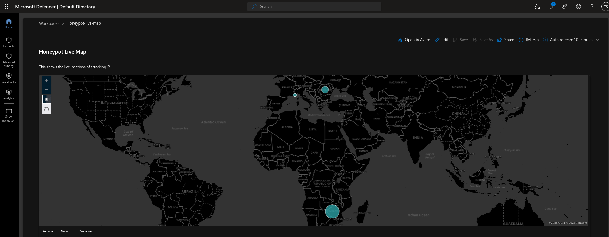
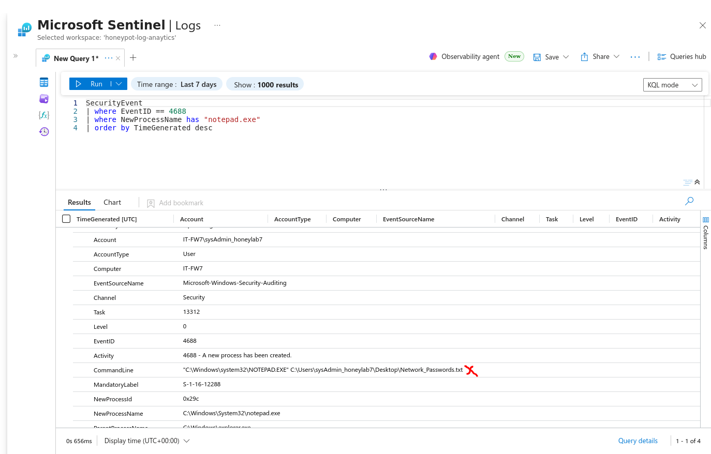
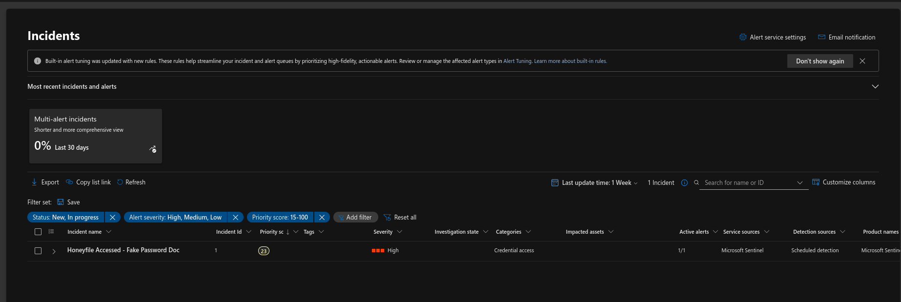
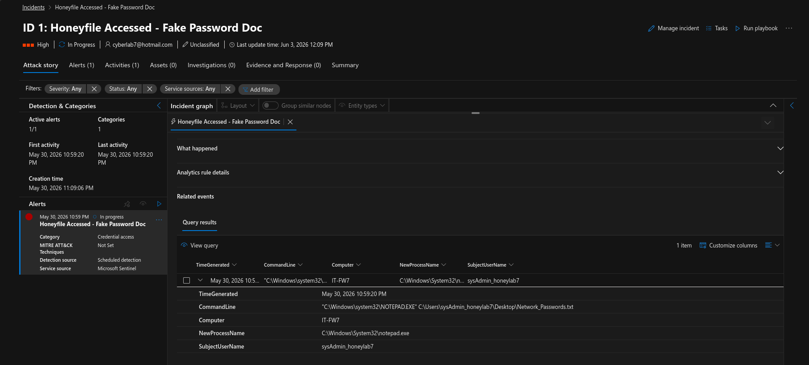

# Azure Sentinel SIEM: Global Threat Mapping & Honeyfile Detection Lab

## Project Overview
This project demonstrates the end-to-end implementation of a cloud-native security operations environment. The objective was to configure a Windows Server virtual machine as a deliberate honeypot target, stream its security log telemetry into Microsoft Sentinel via the Azure Monitoring Agent (AMA), and build high-fidelity detection rules alongside geospatial intelligence dashboards.

### Core Components
* **SIEM / Analytics Platform:** Microsoft Sentinel & Azure Log Analytics Workspaces
* **Endpoint Host:** Windows Server 2022 VM
* **Telemetry Agent:** Azure Monitoring Agent (AMA)
* **Query Language:** Kusto Query Language (KQL)

---

## Phase 1: Geospatial Inbound Attack Mapping
Using a custom workbook in Microsoft Sentinel, I engineered a live dashboard to track and correlate malicious authentication failures globally. 

### KQL Workbook Query
```kusto
SecurityEvent
| where TimeGenerated > ago(7d)
| where EventID == 4625 // Windows Event ID for Failed Logon
| extend GeoInfo = geo_info_from_ip_address(IpAddress)
| extend Country = tostring(GeoInfo.country)
| where isnotempty(Country)
| summarize count() by IpAddress, Country
```

### Threat Landscape Visualization
The parsed telemetry maps failed authentication events directly to threat actor countries of origin, providing high-level defensive visibility:


## Phase 2
To catch unauthorized internal reconnaissance or post-compromise lateral movement, I deployed a "Honeyfile" acting as a canary tripwire (Network_Passwords.txt) on the host desktop.
1. Endpoint Auditing Adjustments

Windows Server does not capture command-line parameters or process actions deeply by default. The local operating system was hardened to output this telemetry:

**Process Auditing:** Flipped `Audit Process Creation` to tracking *Success/Failure* via Local Security Policy (`secpol.msc`).

**Command Line Unmuting:** Injected a new DWORD value `ProcessCreationIncludeCmdLine_Enabled = 1` into the Windows Registry under `HKLM\SOFTWARE\Microsoft\Windows\CurrentVersion\Policies\System\Audit\`.

### 2. Analytics Rule Logic (KQL)

A scheduled analytics rule sweeps the environment logs every 5 minutes to identify any process calling our decoy file path:


### KQL Workbook Query
```kusto
SecurityEvent
| where TimeGenerated > ago(1d)
| where EventID == 4688 // Process Creation
| where NewProcessName has "notepad.exe"
| where CommandLine has "Network_Passwords"
| project TimeGenerated, Computer, NewProcessName, CommandLine, SubjectUserName
```

## Phase 3
Telemetry Match

When a user or attacker interacts with the file, the native command-line context is completely recorded:

### Incident Generation

Sentinel successfully processed the log structure, matched the conditions, and automatically raised a **High Severity Incident** to the SOC triage queue:




Lessons Learned: Incident Graph Mapping

During testing, the interactive Investigation Graph initially showed No entities to display.

Root Cause & Remediated Action: While the underlying KQL query extracted the data, the analytics rule lacked explicit Entity Mapping parameters. To resolve this and fully populate the visual entity graph, the `Computer` column must be structurally mapped to the `Host` entity, and `SubjectUserName` mapped to the `Account` entity within the Azure Sentinel rule configuration wizard.
